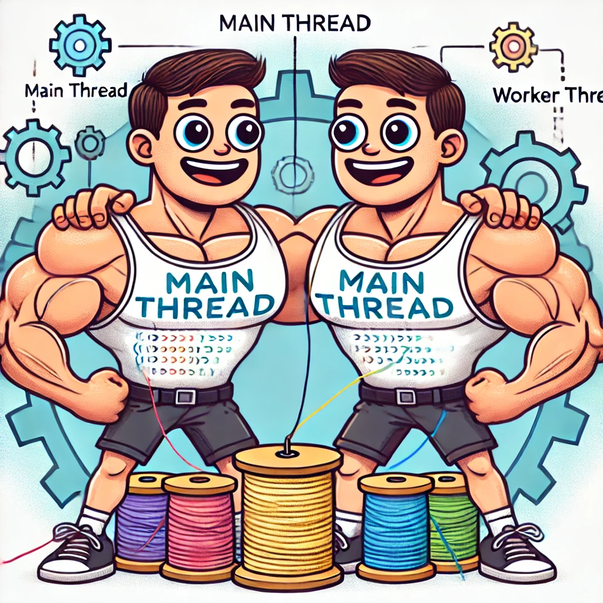
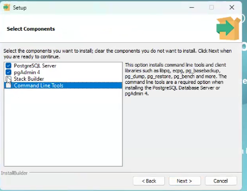
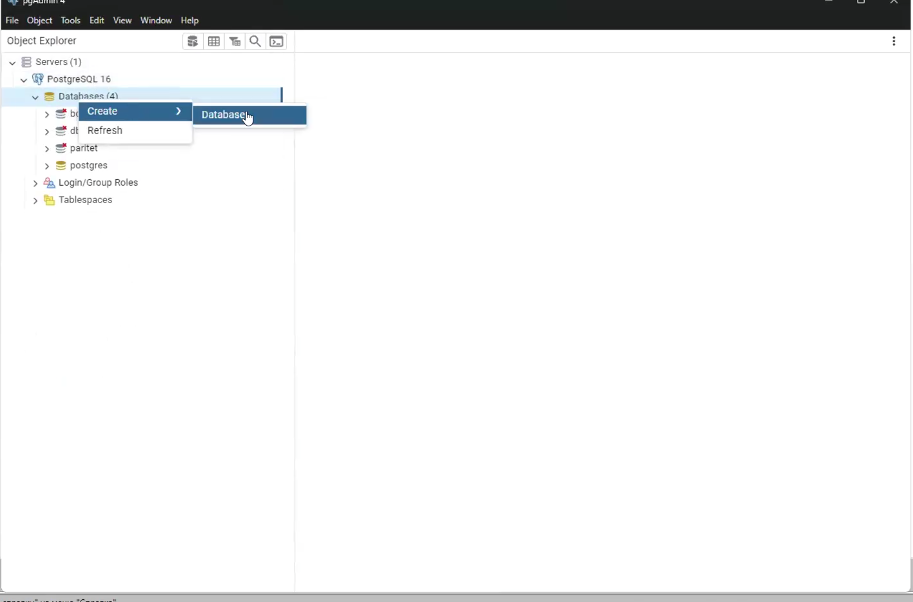
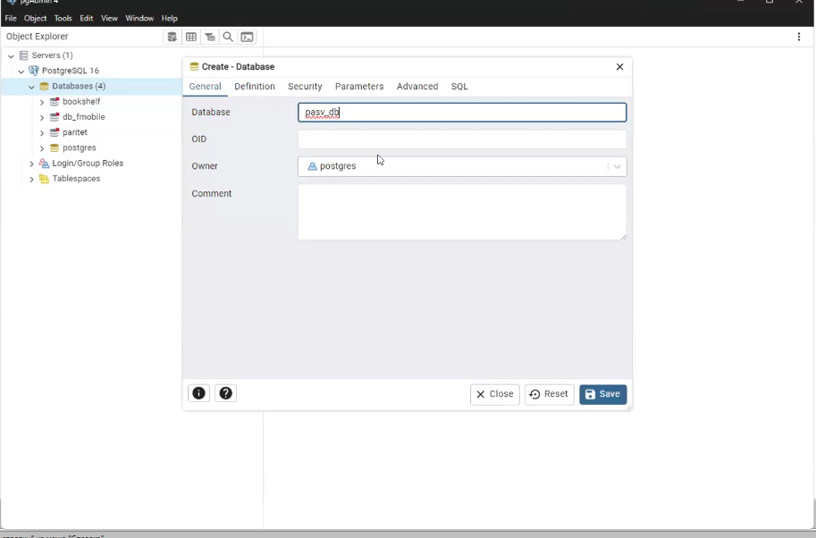
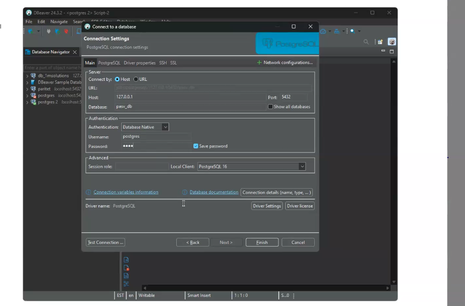
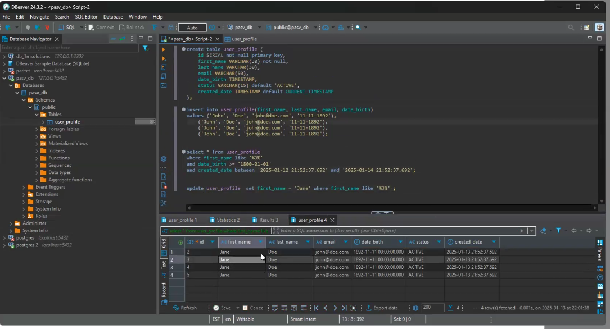

# Dummy summaries 📝✨ of Java lectures

- [Интерфейсы Comparable и Comparator, введение в Java Collections](#интерфейсы-comparable-и-comparator-введение-в-java-collections)
- [Коллекции в Java: LinkedList, HashSet и HashMap](#коллекции-в-java-linkedlist-hashset-и-hashmap)
- [Неизменяемые коллекции, итераторы и циклы в Java](#неизменяемые-коллекции-итераторы-и-циклы-в-java)
- [Дженерики в Java](#дженерики-в-java)
- [Исключения в Java](#исключения-в-java)
- [Annotations](#annotations)
- [Работа с потоками ввода/вывода (Input/Output Streams) в Java](#работа-с-потоками-вводавывода-inputoutput-streams-в-java)
- [Лямбда-выражения и Stream Api в Java](#лямбда-выражения-и-работа-со-stream-api-Java-8)
- [Модель памяти в Java](#модель-памяти-в-java)
- [Введение в многопоточность](#введение-в-многопоточность)
- [Базы данных](#базы-данных)

---------

# Интерфейсы Comparable и Comparator, введение в Java Collections

## 1\.   Введение в Comparable и Comparator

### 1.1 Интерфейс Comparable
- Делает класс самосравнимым
- Реализуется внутри класса
- Использует метод compareTo()


``` java
public class Cat implements Comparable<Cat> {
    private String name;
    private int age;

    @Override
    public int compareTo(Cat other) {
        return this.name.compareTo(other.name);
    }
}
```

### 1.2 Интерфейс Comparator

- Внешний компаратор
- Может быть реализован отдельно от класса
- Использует метод compare()

``` java
public class CatComparator implements Comparator<Cat> {
    @Override
    public int compare(Cat cat1, Cat cat2) {
        return cat1.getName().compareTo(cat2.getName());
    }
}
```

### 1.3 Основные отличия

- Comparable используется для "естественного" порядка сортировки
- Comparator позволяет определить множество способов сортировки
- Comparable реализуется в самом классе, Comparator - отдельно

### 1.4 Функциональные интерфейсы

- И Comparable, и Comparator являются функциональными интерфейсами
- Позволяют использовать лямбда-выражения для краткой записи


## 2.  Введение в Java Collections Framework

### 2.1 Понятие коллекций

- Динамические структуры данных, построенные на основе массивов
- Автоматически расширяются при необходимости
- Предоставляют удобные методы для работы с данными

### 2.2 ArrayList как базовый тип коллекции
- Начальная емкость - 10 элементов
- Увеличивается на 50% при заполнении
- Пример создания:

``` java
List<String> stringList = new ArrayList<>();
```

### 2.3 Основные методы ArrayList
- add() - добавление элемента
- get() - получение элемента по индексу
- remove() - удаление элемента
- contains() - проверка наличия элемента
- addAll() - объединение коллекций
- sort() - сортировка (если элементы реализуют Comparable)

### 2.4 Особенности хранения данных
- Хранят только объекты, не примитивы
- Для примитивов используются классы-обертки (Integer, Double и т.д.)

## 3.  Работа с коллекциями

### 3.1 Способы итерации по коллекции
- Традиционный цикл for с индексом

``` java
for (int i = 0; i < stringList.size(); i++) {
    System.out.println(stringList.get(i));
}
```

- Цикл for-each

``` java
for (String s : stringList) {
    System.out.println(s);
}
```

- Метод forEach() с лямбда-выражением

``` java
stringList.forEach(s -> System.out.println(s));
```

- Stream API с лямбда-выражениями

``` java
stringList.stream().forEach(fl -> fl);
```

### 3.2 Использование ссылок на методы

- Краткая запись для вызова методов при итерации

``` java
stringList.forEach(System.out::println);
```

### 3.3 Фильтрация элементов

- Использование метода filter() в Stream API

``` java
stringList.stream()
    .filter(Objects::nonNull)
    .forEach(System.out::println);
```

## 4.  Обобщения (Generics) в коллекциях

### 4.1 Определение типа элементов

- Использование синтаксиса <Type>
- Обеспечивает типобезопасность на этапе компиляции

``` java
List<Cat> catList = new ArrayList<>();
```

### 4.2 Использование wildcards

- Символ ? для обозначения неизвестного типа
- Позволяет создавать более гибкие методы

``` java
public void printList(List<?> list) {
    for (Object o : list) {
        System.out.println(o);
    }
}
```

### 4.3 Ограничения по иерархии классов

- Можно ограничить тип элементов определенной иерархией

``` java
List<? extends Animal> animalList = new ArrayList<>();
```

## 5.  Внутреннее устройство ArrayList

### 5.1 Динамическое расширение

- При достижении предела емкости создается новый массив
- Элементы копируются в новый массив
- Размер увеличивается на 50%

### 5.2 Метод add()

- Проверяет текущий размер
- Если нужно, вызывает метод grow()
- Копирует элементы в новый, увеличенный массив


## 6.  Сравнение коллекций

### 6.1 Метод containsAll()

- Проверяет, содержит ли одна коллекция все элементы другой
- Учитывает порядок элементов

### 6.2 Сортировка коллекций

- Использование метода Collections.sort()
- Работает с Comparable объектами или с отдельным Comparator


## 7.  Заключение

- Коллекции предоставляют удобные инструменты для работы с наборами данных
- Выбор типа коллекции зависит от конкретной задачи
- Интерфейсы Comparable и Comparator позволяют гибко настраивать сортировку
- Generics обеспечивают типобезопасность при работе с коллекциями


*****************************************************************************************************************************************************************
# Коллекции в Java: LinkedList, HashSet и HashMap

## 1\. Введение

## 2\. LinkedList (Связанный список)

### 2.1 Структура LinkedList

  - LinkedList - это двунаправленный связанный список
  - Каждый элемент (нода) содержит:
      - Само значение (item)
        Ссылку на предыдущий элемент
        Ссылку на следующий элемент

### 2.2 Особенности LinkedList

  - Элементы могут быть разбросаны по памяти
  - Первый элемент имеет null в качестве ссылки на предыдущий
  - Последний элемент имеет null в качестве ссылки на следующий

### 2.3 Преимущества LinkedList

  - Константное время (O(1)) для вставки и удаления элементов в любой позиции
  - Эффективен при частых операциях вставки/удаления в середине списка

### 2.4 Недостатки LinkedList

  - Медленнее в итерации по сравнению с ArrayList
    Занимает больше памяти из-за хранения дополнительных ссылок

### 2.5 Сравнение с ArrayList

  - ArrayList быстрее для операций доступа по индексу и итерации
  - ArrayList медленнее для вставки/удаления в середине (требует сдвига элементов)

## 3\. HashSet

### 3.1 Структура HashSet

  - Использует массив "корзин" (buckets) для хранения элементов
  - Элементы распределяются по корзинам на основе их хэш-кода

### 3.2 Принцип работы HashSet

1.  При добавлении элемента вызывается его метод hashCode()
2.  На основе полученного хэш-кода вычисляется номер корзины
3.  Элемент помещается в соответствующую корзину

### 3.3 Особенности HashSet

  - Хранит только уникальные элементы
  - Не гарантирует порядок элементов
  - Обеспечивает быстрый доступ и вставку (в среднем O(1))

### 3.4 Коллизии в HashSet

  - Коллизия возникает, когда два разных элемента имеют одинаковый хэш-код
  - Решение коллизий:
    1.  Создание связанного списка внутри корзины
    2.  При большом количестве коллизий преобразование в бинарное дерево

### 3.5 Важность правильной реализации hashCode() и equals()

  - Разные объекты должны иметь разные хэш-коды
  - Одинаковые объекты должны иметь одинаковые хэш-коды
  - Метод equals() должен быть согласован с hashCode()

## 4\. HashMap

### 4.1 Структура HashMap

  - Похожа на HashSet, но хранит пары ключ-значение
  - Использует хэш-код ключа для определения корзины

### 4.2 Принцип работы HashMap

1.  При добавлении пары вызывается hashCode() ключа
2.  Вычисляется номер корзины на основе хэш-кода
3.  Пара ключ-значение помещается в соответствующую корзину

### 4.3 Основные методы HashMap

  - put(key, value): добавление или обновление пары
  - get(key): получение значения по ключу
  - remove(key): удаление пары по ключу
  - containsKey(key): проверка наличия ключа
  - containsValue(value): проверка наличия значения

### 4.4 Особенности HashMap

  - Ключи должны быть уникальными
  - Значения могут повторяться
  - Null может быть использован как ключ (только один раз) и как значение
    
### 4.5 Интересный факт

  - HashSet внутренне реализован с использованием HashMap
  - В HashSet значения используются как ключи в HashMap, а в качестве значений используется dummy object

## 5\. Практическое применение

### 5.1 Выбор коллекции

  - ArrayList: для частого доступа по индексу и итерации
  - LinkedList: для частых вставок/удалений в середине списка
  - HashSet: для хранения уникальных элементов с быстрым доступом
  - HashMap: для хранения пар ключ-значение с быстрым доступом по ключу

### 5.2 Примеры использования

  - HashMap для хранения информации о версиях мобильных платформ:
    ``` java
    Map<String, String> platformVersions = new HashMap<>();
    platformVersions.put("iOS", "14.5");
    platformVersions.put("Android", "11");
    platformVersions.put("Huawei", "EMUI 11");
    ```

### 5.3 Производительность

  - На небольших объемах данных (до 500 элементов) разница в производительности может быть незаметна
  - На больших объемах данных правильный выбор коллекции критичен для производительности

## 6\. Заключение

  - ArrayList и HashMap используются в 97% случаев на практике
  - LinkedList и HashSet имеют более узкие области применения, но важны для понимания
  - Правильный выбор коллекции зависит от конкретной задачи и ожидаемых операций

---------------------

# Неизменяемые коллекции, итераторы и циклы в Java

1.  Неизменяемые коллекции (Immutable collections)

1.1. Создание неизменяемых коллекций

  - Используются методы `of()` для List, Set и Map
  - Пример: `List<String> immutableList = List.of("элемент1", "элемент2", "элемент3");`

1.2. Особенности неизменяемых коллекций

  - После инициализации нельзя добавлять, удалять или изменять элементы
  - При попытке модификации выбрасывается UnsupportedOperationException
  - Пример:
    ``` java
    List<String> immutableList = List.of("Hello", "World");
    immutableList.add("New"); // Выбросит UnsupportedOperationException
    ```

1.3. Применение неизменяемых коллекций

  - Полезны для создания коллекций с значениями по умолчанию, которые не должны изменяться
  - Обеспечивают безопасность и предсказуемость в многопоточной среде

1.4. Важное замечание

  - Хотя саму коллекцию нельзя изменить, объекты внутри неё могут быть изменяемыми
  - Пример:
    ``` java
    List<StringBuilder> list = List.of(new StringBuilder("Hello"));
    list.get(0).append(" World"); // Это допустимо
    ```

2.  Итерация и модификация коллекций

2.1. Стандартный цикл for

  - Позволяет безопасно модифицировать коллекцию во время итерации
  - Пример:
    ``` java
    for (int i = 0; i < list.size(); i++) {
        if (condition) {
            list.remove(i);
            i--; // Важно уменьшить счетчик после удаления
        }
    }
    ```

2.2. Цикл for-each (enhanced for loop)

  - Эффективен для итерации, но не позволяет модифицировать коллекцию
  - При попытке модификации выбрасывает ConcurrentModificationException
  - Пример:
    ``` java
    for (String item : list) {
        if (condition) {
            list.remove(item); // Выбросит ConcurrentModificationException
        }
    }
    ```

2.3. Использование итераторов

  - Обеспечивают безопасный способ модификации коллекции во время итерации
  - Пример:
    ``` java
    Iterator<String> iterator = list.iterator();
    while (iterator.hasNext()) {
        String item = iterator.next();
        if (condition) {
            iterator.remove();
        }
    }
    ```

2.4. Аналогия с комнатой (для понимания работы for-each)

  - Преподаватель сравнивает for-each с входом в комнату: "Представьте, что вы зашли в комнату, точно зная расположение всех предметов. Если кто-то удалит дверь, пока вы внутри, возникнет проблема. Так же работает for-each: он "входит" в коллекцию, зная все её элементы, и не ожидает изменений во время работы."

3.  Современные методы модификации коллекций

3.1. Метод removeIf()

  - Предоставляет более лаконичный способ удаления элементов по условию
  - Построен на принципах работы итератора, но с более читаемым синтаксисом
  - Пример:
    ``` java
    list.removeIf(item -> item.equals("value"));
    ```

3.2. Сравнение с традиционными подходами

  - Более краткий и читаемый код
  - Меньше вероятность ошибок при написании


4.  Многопоточные коллекции (краткое упоминание)

4.1. ConcurrentHashMap

  - Предназначен для безопасной работы в многопоточной средe
  - Обеспечивает потокобезопасную модификацию при одновременном доступе из разных потоков

4.2. Пример использования (концептуально):

``` java
ConcurrentHashMap<String, Integer> map = new ConcurrentHashMap<>();
// Безопасно для использования в разных потоках
map.put("key", 1);
map.get("key");
```

5.  Практические рекомендации

5.1. Выбор правильного цикла

  - Для простого перебора без модификации: for-each
    Для модификации во время итерации: стандартный for или итератор

5.2. Использование современных методов

  - Предпочтительно использовать removeIf() и другие современные методы там, где это возможно
  - Они более читаемы и менее подвержены ошибкам

6.  Заключение

  - Неизменяемые коллекции полезны для создания коллекций с фиксированным содержимым
  - При работе с коллекциями важно учитывать особенности различных циклов и методов итерации
  - Итераторы предоставляют гибкий способ модификации коллекций во время обхода
  - Современные методы Java (например, removeIf()) упрощают работу с коллекциями, сохраняя безопасность операций


---------

# Дженерики в Java

## Введение в дженерики

Дженерики (обобщения) в Java - это механизм, позволяющий создавать классы, интерфейсы и методы, которые могут работать с различными типами данных, сохраняя при этом типобезопасность.

### Основные понятия:

  - Угловые скобки `<>` используются для объявления дженериков
  - Буквы `T`, `E` и другие часто используются как параметры типа
  - Пример: `List<String>` - список, содержащий только строки

### Цель дженериков:

1.  Уменьшение дублирования кода
2.  Обеспечение типобезопасности на этапе компиляции
3.  Создание универсальных классов и методов

## Создание дженерик-классов

Рассмотрим пример создания класса `Box<T>`:

``` java
public class Box<T> {
    private T[] array;

    public Box(int size) {
        this.array = (T[]) new Object[size];
    }

    public void add(T item) {
        for (int i = 0; i < array.length; i++) {
            if (array[i] == null) {
                array[i] = item;
                return;
            }
        }
        throw new RuntimeException("Нет места в массиве");
    }

    public T getFirst() {
        for (T item : array) {
            if (item != null) {
                return item;
            }
        }
        return null;
    }
}
```

Этот класс позволяет создавать "коробки" для хранения элементов любого типа:

  - `Box<Integer>` - для целых чисел
  - `Box<String>` - для строк
  - `Box<CustomObject>` - для пользовательских объектов

## Дженерик-методы

Методы также могут быть обобщенными:

``` java
public <T extends Number> List<T> fromArrayToList(T[] array) {
    return Arrays.asList(array);
}
```

Этот метод работает с массивами любого подкласса `Number`.

## Wildcards и ограничения

### Wildcard (?)

Символ `?` представляет неизвестный тип.

### Верхняя граница (Upper Bound):

``` java
List<? extends Vehicle> vehicles
```

Принимает `Vehicle` или его подклассы.

### Нижняя граница (Lower Bound):

``` java
List<? super Vehicle> vehicles
```

Принимает `Vehicle` или его суперклассы.

### Важно помнить:

  - `extends` часто используется для чтения (read-only)
  - `super` позволяет и чтение, и запись

## Стирание типов (Type Erasure)

При выполнении программы информация о дженерик-типах стирается:

  - Компилятор заменяет обобщенные типы на `Object` или ограниченный тип
  - Это обеспечивает обратную совместимость с кодом, написанным до введения дженериков

## Утилитные методы с дженериками

Пример метода, который может работать с "коробками" любого типа:

``` java
public static void printBoxes(Box<?>... boxes) {
    for (Box<?> box : boxes) {
        System.out.println(box.getFirst());
    }
}
```

Использование varargs (`...`) позволяет передавать несколько аргументов.

## Ограничения дженериков

1.  Нельзя использовать примитивные типы напрямую (используйте классы-обертки)
2.  Нельзя создавать экземпляры параметров типа
3.  Нельзя создавать массивы параметризованных типов

## Практические советы

1.  Используйте дженерики для создания универсальных утилитных классов и методов
2.  При работе с коллекциями всегда указывайте тип элементов
3.  Используйте ограничения типов для более точного контроля над дженериками

## Заключение

Дженерики - мощный инструмент в Java, позволяющий создавать более гибкий и типобезопасный код. Они широко используются в стандартной библиотеке Java и являются важной частью современной разработки на Java.

---------------------
# Исключения в Java

### Введение

* Исключения (exceptions) – это механизм обработки ошибок в Java, возникающих во время выполнения программы (runtime).
* Исключительные ситуации могут возникать по разным причинам: ошибки ввода данных, неправильные вычисления, проблемы с доступом к файлам и т.д.

### Типы исключений

* Все исключения в Java наследуются от класса `Throwable`. Существует два основных типа исключений:
    1. **Checked Exceptions:**
       * Эти исключения компилятор проверяет во время компиляции кода. 
       * Если метод может выбросить checked exception, то он должен либо объявить это в своей сигнатуре с помощью ключевого слова `throws`, либо обработать исключение внутри блока `try-catch`.
       * Пример: `IOException` (возникает при работе с файлами).
    2. **Unchecked Exceptions (RuntimeException):**
       * Эти исключения не проверяются компилятором. 
       * Программа не обязана обрабатывать эти исключения, но может это делать по своему усмотрению.
       * Пример: `ArrayIndexOutOfBoundsException` (возникает при выходе за границы массива), `ArithmeticException` (возникает при делении на ноль).

### Обработка исключений: блок `try-catch`

* **`try { ... }`:** Внутри этого блока помещается код, который потенциально может выбросить исключение.
* **`catch (ТипИсключения имяПеременной) { ... }`:** Этот блок обрабатывает исключение определенного типа. `ТипИсключения` должен соответствовать типу ожидаемого исключения, а `имяПеременной` – это имя переменной, которая будет содержать объект исключения. Внутри блока `catch` можно выполнить действия по обработке ошибки, например, вывести сообщение об ошибке, записать информацию в лог-файл или предпринять другие действия для восстановления работы программы.
* **Порядок блоков `catch`:** Если несколько блоков `catch` ловят исключения, находящиеся в одной иерархии наследования (например, `ArithmeticException` и `RuntimeException`), то блок `catch` для потомка должен стоять перед блоком `catch` для родителя. В противном случае, блок `catch` для родителя перехватит все исключения этого типа, и блок `catch` для потомка никогда не будет выполнен.

### Блок `finally`

* **`finally { ... }`:** Этот блок выполняется всегда, независимо от того, было ли выброшено исключение или нет. Обычно в блоке `finally` выполняется закрытие ресурсов, таких как файлы или потоки ввода-вывода, чтобы предотвратить утечки ресурсов.

### Создание пользовательских исключений

* Можно создавать собственные классы исключений, расширяя `RuntimeException` или `Exception`.
* Пример: `public class ArtemException extends RuntimeException { ... }`.

### Пример использования `try-catch-finally` и собственного исключения

```java
int[] array = {0, 1, 2, 3, 4, 5, 6, 7, 8, 9, 10};

try {
    for (int i = 0; i <= array.length; i++) {
        System.out.println(array[i]);
    }
} catch (ArrayIndexOutOfBoundsException | ArithmeticException exception) {
    System.err.println("Out of array range");
} catch (Exception exception) {
    System.err.println("EXCEPTION");
}

try {
    Thread.sleep(3000);
} catch (InterruptedException e) {
    System.err.println(e.getMessage());
}

try (Scanner scanner = new Scanner(System.in);
     FileInputStream fis = new FileInputStream("some.txt")) {
    divideByZero();
} catch (ArithmeticException | ArtemException e) {
    System.err.println(e.getMessage());
} catch (Exception e) {
    System.err.println("Some issue");
} finally {
    System.out.println("FINALLY");
    scanner.close();
}


public static void divideByZero() {
    Scanner scanner = new Scanner(System.in);
    int x = scanner.nextInt();
    if (x == 0) {
        throw new ArithmeticException("Divide by zero");
    } else {
        System.out.println(1/x);
    }
    scanner.close();
}


public static void someMethod() {
    throw new ArtemException("Some issue");
}
```

### Важные моменты

* Иерархия исключений: `Throwable` -> `Exception` -> `Checked` или `Unchecked`.
* `RuntimeException` является подклассом `Exception`.
* `Error` - это критичные ошибки, с которыми невозможно работать.
* `Finally` блок выполняется всегда, независимо от результата блока `try`.
* `Try-catch` можно использовать в любом методе, где потенциально может возникнуть исключение.
* Можно создавать свои исключения, наследуясь от `RuntimeException` или `Exception`.

---------------
# Annotations

## Что такое аннотации?

* Мощный инструмент для пометки классов и методов, чтобы те выполняли определённую логику.
* Позволяют задать метаданные к элементам кода, не изменяя их основное назначение.
* Применяются к классам, полям, методам, параметрам, конструкторам, переменным.
* Позволяют проводить проверку и фильтрацию на любом этапе обработки данных, в том числе на этапе написания кода, компиляции и выполнения программы.
* Работают с помощью аннотационного процессора, который сам разработчик может создать.

## Типы аннотаций

* **Target:** Указывает цель или область действия аннотации. Определяет, где именно может быть поставлена аннотация.
* **Retention:** Определяет, насколько долго хранятся аннотации, доступные для использования. Возможные значения:
	* SOURCE - только на этапе написания кода
	* CLASS - во время компиляции и выполнения программы
	* RUNTIME - доступна на всех этапах, используется для изменения поведения класса или метода.

## Пример использования аннотации

### Задача:
Предположим, есть класс Phone с атрибутом locked и методами takePhoto и unlock().  Нужно создать аннотацию, которая будет проверять статус телефона (заблокирован или разблокирован) перед выполнением определённых действий.

### 1. Создание аннотации

```java
@Target(ElementType.TYPE)
@Retention(ElementType.RUNTIME)
public @interface IsLockePhone {
    boolean locked() default false;
}
```

### 2. Использование аннотации

```java
@IsLockePhone(locked = true)
public class Phone {
    private String name;
    private boolean locked = true; 

    public Phone(String name) {
        this.name = name;
    }

    public void takePhoto() {
        if (isLocked()) {
            System.out.println("Phone is locked!");
        } else {
            System.out.println("CLICK CLIK!");
        }
    }

    @PhoneGenerallyAvailable
    public void unlock() {
        if (!locked) {
            System.out.println("Phone unlocked successfully!");
            locked = false;
        } else {
            System.out.println("Phone already unlocked!");
        }
    }
}
```

### 3. Создание аннотационного процессора

```java
public static void annotationProcessor(Class<?> clazz) {
    boolean isLockedPhoneAnnotationPresent = clazz.isAnnotationPresent(IsLockedPhone.class);

    if (isLockedPhoneAnnotationPresent) {
        IsLockedPhone isLockedPhone = clazz.getAnnotation(IsLockedPhone.class);

        for (Method method : clazz.getDeclaredMethods()) {
            boolean isPhoneGenerallyAvailableAnnotationPresent = method.isAnnotationPresent(PhoneGenerallyAvailable.class);

            if (isPhoneGenerallyAvailableAnnotationPresent) {
                PhoneGenerallyAvailable annotation = method.getAnnotation(PhoneGenerallyAvailable.class);
                Constructor<?> constructor = clazz.getConstructor(Phone.class);
                constructor.setAccessible(true);

                method.invoke(constructor);

                System.out.println("Phone is not ready yet!");
            } else {
                System.out.println("Phone is not ready yet!");
            }
        }


        if (isLockedPhone.locked()) {
            System.out.println("Phone is fully locked!");
        } else {
            System.out.println("Phone is not present!");
        }
        
    } 
    else {
        System.out.println("Is not present!");
    }
}
```

Таким образом, данный код выполнит проверку, заблокирован ли телефон перед выполнением методов и выведет соответствующие сообщения.

*****************************************************************************************************************************************************************************************************

# Работа с потоками ввода/вывода (Input/Output Streams) в Java

## 1\. Введение:

В данной лекции рассматривается пакет java.io, отвечающий за ввод и вывод данных в Java. Этот пакет содержит классы для работы с различными типами ввода и вывода, включая файлы, консоль и сетевые потоки.

Основное внимание уделяется работе с байтовыми потоками (InputStream и OutputStream) и их базовым реализациям, которые являются надстройками над байтовыми потоками, потому что в конечном итоге данные передаются как байты.
    

### 1. Потоки (Streams):

Что такое поток? Поток - это абстрактное представление последовательности данных. *Можно представить поток как реку, из которой можно черпать воду (читать данные) или сливать воду обратно (записывать данные).* Существуют разные способы взаимодействия с потоком (аналогия с черпанием воды ложкой или ведром).

 Виды потоков: 
 
 В Java есть два основных типа потоков:

- **InputStream: для чтения данных.** Аналогично System.in (стандартный ввод), который тоже является реализацией InputStream.

- **OutputStream: для записи данных.** Аналогично System.out.println(), который использует OutputStream для вывода на консоль.

	

### 2. ByteArrayInputStream и ByteArrayOutputStream:

Это базовые, низкоуровневые реализации InputStream и OutputStream соответственно. Они работают с массивами байтов (byte array).

- String.getBytes() преобразует строку в массив байтов.
- ByteArrayInputStream(byte[] data): Этот конструктор создает поток ввода данных (InputStream), основанный на переданном массиве байтов. Метод read() считывает байты из потока по одному. Если байты закончились, метод возвращает -1.
- ByteArrayOutputStream(): запись в массив байтов. Каждый байт записывается в ByteArrayOutputStream с помощью метода write().
- _baos_.toByteArray() возвращает массив байтов,
- _baos_.toString() – возвращает строковое представление байтов, содержащихся в ByteArrayOutputStream. По умолчанию интерпретируется, как строка в кодировке UTF-8 (или другой, если передать кодировку).

### Кодировки (Encodings):

Каждый символ имеет свой байтовый код. Для корректной работы с разными языками (например, кириллицей) важно использовать правильную кодировку.

_Пример: Если текст на кириллице записать в ByteArrayOutputStream и затем прочитать из ByteArrayInputStream побайтно, то без правильной кодировки результат будет некорректным ("абракадабра"). Кириллические символы занимают два байта, поэтому интерпретатор может неправильно их прочитать._

UTF-8: Одна из распространённых кодировок, которая позволяет корректно работать с кириллицей и другими символами, требующими больше одного байта.

Base64: Способ кодирования бинарных данных в текстовый формат. Используется для передачи данных через каналы, не поддерживающие бинарные данные (например, email, HTML). Пример: Преобразование изображения в Base64.

### 3.DataInputStream и DataOutputStream:

Позволяют записывать/читать примитивные типы данных (int, double, boolean, String).
Например, данные которые сохраняются в файл, сохраняются последовательно, в том же порядке, в котором были записаны.
При чтении данных важно соблюдать ту же последовательность типов, что и при записи. Если нарушить порядок, возникнет ошибка.

### 4.ObjectOutputStream и ObjectInputStream:

Позволяют **сериализовать** (сохранять) и **десериализовать** (восстанавливать) объекты Java в файл.
Сериализация: Процесс преобразования объекта в последовательность байтов для хранения или передачи.
Десериализация: Процесс восстановления объекта из последовательности байтов.
_Пример: Сохранение объекта класса Cat в файл с помощью ObjectOutputStream и последующее его чтение с помощью ObjectInputStream. vasikSerialized.dat_

### 5. Работа с файлами (File Input/Output Stream):

FileInputStream и FileOutputStream - это реализации InputStream и OutputStream для работы с файлами.
Читаем данные из FileInputStream побайтно с помощью read() и записываем в FileOutputStream с помощью write().

_**BufferedReader и BufferedWriter:**_ Для повышения эффективности работы с файлами (чтение/запись по блокам данных, а не по одному байту), лучше использовать BufferedReader и BufferedWriter, благодаря его методу readLine(). Он читает одну строку (до символа конца строки), возвращает ее как String, или null, если достигнут конец файла.

### Закрытие ресурсов (Closing Resources):
Важно: Все потоки (InputStream, OutputStream, Reader, Writer) должны быть закрыты после использования для освобождения ресурсов.
_try-with-resources:_ Рекомендуемый способ работы с ресурсами, гарантирующий их закрытие даже в случае возникновения ошибок. Альтернатива – блок finally.

*********************************************************************************************************************************************************************************************

# Лямбда-выражения и работа со Stream Api Java 8

## 1. Лямбда-выражения

Лямбда-выражения, которые появились в Java 8, представляют собой анонимные функции. Они позволяют сократить объем кода и упростить работу с функциональными интерфейсами. 
Это блок кода, который может быть передан для выполнения. Формат: `(параметры) -> тело`.

  ```java
  (a) -> "hello";

  ```

## 2. Работа с коллекциями и Stream Api

Предположим, нужно найти в коллекции строку и что-то с ней сделать (выделить или записать в другую коллекцию). Раньше для таких операций использовали циклы (for или for-each). Если в коллекции будут какие-то заполненные объекты, то потребуется делать дополнительные проверки и условия для проверки значений (if, else и т.д.).

Когда в Java появилась восьмая версия, в ней добавили стримы. Коллекция преобразуется в стрим, и в нем выполняются нужные действия. В одном потоке можно выполнить много операций (например, использовать много фильтров, применять функции и т.д.).
   
### 2.1 Преобразование коллекции в стрим

Стрим позволяет выполнять последовательные операции над данными, например, фильтрацию, трансформацию, сборку.

```
List<String> strings = List.of("hello", "world", "!");
strings.stream();
```

Для защиты от NullPointerException требуется использовать дополнительную проверку, например  `filter(ft -> Objects.isNull(ft)). ` Objects - класс-утилита для работы со всеми объектами, метод isNull проверяет значение на равенство null. 


### 2.2 Основные методы стрима

- filter: фильтрует данные по условию.

```
strings.stream().filter(f -> "world".equals(f));
```
- findFirst: возвращает первый элемент, удовлетворяющий условию.
- orElse: возвращает значение по умолчанию, если результат пуст.

```
Optional<String> result = strings.stream()
                                 .filter(f -> "world".equals(f))
                                 .findFirst();
 				 .orElse("NOT FOUND");
```

- Для предотвращения ошибок типа NullPointerException, можно добавить проверку:

```
.filter(Objects::nonNull)
```

Если элемент равен null, он будет исключён из дальнейшей обработки.

## Пример: Обработка банковских карт

- Создание списка карт:

```
List<Card> cards = new ArrayList<>();
cards.add(new Card("Jane Doe", "5600000000000002", null));
cards.add(new Card("John Doe", "4400000000000000", null));
```
- Фильтрация карт с номерами длиной 16 символов:

```
List<Card> filteredCards = cards.stream()
    .filter(card -> Objects.nonNull(card.getCardNumber()))
    .filter(card -> card.getCardNumber().length() == 16)
    .toList();
```

Определение платёжной системы по первой цифре:

```
List<Card> processedCards = cards.stream()
    .map(card -> {
        Card commonCard = new Card(card.getHolderName(), card.getCardNumber(), null);
        switch (card.getCardNumber().substring(0, 1)) {
            case "4" -> commonCard.setPaySystem(PaySystem.VISA);
            case "5" -> commonCard.setPaySystem(PaySystem.MASTERCAR);
            case "6" -> commonCard.setPaySystem(PaySystem.DISCOVER);
        }
        return commonCard;
    })
    .toList();
```

## Дополнения:

### **Терминальные методы (Terminal Methods)**

- Завершают работу потока, возвращая результат вычислений.
- Выполняют действия на основе всего потока.
- После вызова терминального метода стрим становится недоступным для дальнейших операций.

**Примеры**:
- `toList()` — собирает элементы потока в список:
```java
List<String> result = strings.stream()
			 .filter(s -> s.length() > 3)
			 .toList();
```

### **Нетерминальные методы (Intermediate Methods)**

- Возвращают новый стрим, позволяя цепочку вызовов.
- Не завершают поток; они подготавливают данные для терминальной операции.

**Примеры**:
- `filter(Predicate)` — фильтрует элементы, оставляя только те, которые соответствуют предикату.

```java
strings.stream().filter(s -> s.equals("world"));
```

- `map(Function)` — применяет функцию к каждому элементу, возвращая преобразованный поток.

```java
strings.stream().map(String::toUpperCase);
```
## Полезно 

### **Что принимают и возвращают методы**

### **Метод `filter`**
- **Принимает**: объект типа `Predicate<T>` (предикат — функциональный интерфейс, принимающий объект и возвращающий `boolean`).
- **Возвращает**: новый поток с элементами, соответствующими предикату.
  
  ```java
  List<String> strings = List.of("hello", "world", "java");
  List<String> filtered = strings.stream()
                                 .filter(s -> s.startsWith("h"))
                                 .toList();
  ```

### Метод map

Принимает: объект типа Function<T, R> (функция, преобразующая объект из типа T в тип R).
Возвращает: поток преобразованных данных.

```java
List<String> upperCaseStrings = strings.stream()
                                       .map(String::toUpperCase)
                                       .toList();
```

### Метод forEach

Принимает: объект типа Consumer<T> (операция, принимающая элемент потока и не возвращающая значения).
Возвращает: ничего; выполняет действие для каждого элемента.

```
strings.stream().forEach(System.out::println);
```

### Лямбда-выражения используемые внутри методов

Принимают: входные параметры, определяемые пользователем.
Возвращают: вычисленное значение или void, если указан консюмер.

```
strings.stream()
       .filter(s -> s.length() > 4) // Лямбда возвращает boolean
       .map(s -> s.toUpperCase())  // Лямбда возвращает преобразованную строку
       .forEach(s -> System.out.println(s)); // Лямбда выполняет действие
```

### Полезные функциональные интерфейсы

- Predicate<T>:
        Описывает условие.
        Метод: boolean test(T t).
- Function<T, R>:
        Преобразует данные.
        Метод: R apply(T t).
- Consumer<T>:
        Принимает данные и выполняет действие.
        Метод: void accept(T t).
- Supplier<T>:
        Поставляет данные.
        Метод: T get().

### Двойное двоеточие (::)
Двойное двоеточие (::) — это сокращённая форма для ссылки на методы и конструкторы, которая используется в Java 8. Оно облегчает запись, делая код более компактным и читаемым.
Виды ссылок с двойным двоеточием

- Ссылка на статический метод
    ClassName::staticMethodName
- Ссылка на метод экземпляра конкретного объекта
    instance::methodName
- Ссылка на метод экземпляра произвольного объекта типа
    ClassName::methodName
- Ссылка на конструктор
    ClassName::new

```
 names.stream()
             .map(String::toUpperCase) // Ссылка на метод toUpperCase
             .forEach(System.out::println); // Ссылка на метод println
```

```
public class DoubleColonExample {

    public static void main(String[] args) {
        List<String> names = List.of("Alice", "Bob", "Charlie");

        // Используем кастомный предикат
        Predicate<String> isLongerThanThree = MyStringUtils::isLongerThanThree;

        names.stream()
             .filter(isLongerThanThree) // Фильтрация по кастомному предикату
             .forEach(System.out::println);
    }
}

// Утилитарный класс с методом
class MyStringUtils {
    // Метод, проверяющий длину строки
    public static boolean isLongerThanThree(String s) {
        return s.length() > 3;
    }
}
```
*********************************************************************************************************

# Модель памяти в Java

## Обзор памяти в Java

### Стэк (Stack)

**Принцип LIFO (last in, first out) - последний пришел, первый ушел.**

В стэке хранится:

- Последовательность вызова методов, начиная с метода main.

- Имена переменных.

- Имена методов.

Пример:

    В методе main вызывается другой метод.

    Из этого метода вызывается ещё один метод.

    Эта цепочка может продолжаться.

    Выполнение методов происходит по принципу LIFO.

    После завершения последнего метода, возвращаемся к предыдущему, затем к предыдущему, и так далее, до метода main.

- При объявлении объекта Object obj = new Object() в методе, создаётся ссылка на конкретный участок памяти в куче (heap).

- Когда метод завершает работу, ссылки на объекты удаляются, но сами объекты остаются.

_Как удаляются объекты из памяти? С помощью сборщика мусора (Garbage Collector)._

### Куча (Heap)

- В куче хранятся сами объекты.
- Размер памяти, выделяемый под объект, определяется при его создании, исходя из размеров полей и данных в объекте.
- Сборщик мусора удаляет объекты, на которые нет ссылок.

### Структура кучи (Heap)

Куча разделена на области:

- Young Generation (молодое поколение) - для новых объектов :

        Eden (Эдем) - сюда попадают новые объекты.

        Survivor Space S0 (Пространство выживших 0) - здесь хранятся объекты, пережившие первую очистку сборщика мусора.

        Survivor Space S1 (Пространство выживших 1) - аналогично S0, но после нескольких очисток в Эдеме.

- Old Generation (старое поколение) - для долгоживущих объектов.

      Permanent Space/Metaspace (перманентное пространство/метапространство) - для метаданных классов и строк.

### Работа Young Generation (Молодое поколение)

    - При первом запуске программы и работе сборщика мусора, объекты со ссылками копируются в любой свободный Survivor space (S0 или S1).

    - Объекты без ссылок удаляются.

    - При следующем запуске сборщика мусора проверяются объекты в Eden и занятом Survivor Space.

    - Объекты со ссылками копируются в свободный Survivor Space.

    - Eden и занятый Survivor Space очищаются.

    - Объекты, пережившие несколько очисток, перемещаются в Old Generation.

### Особенности Permanent Space/Metaspace:

    - В Java < 8 - это Permanent Space. В Java >= 8 - это Metaspace. 
    Раньше были проблемы с Исключением OutOfMemoryError, которое возникает при превышении лимита физической памяти.

    - До Java 8 размер памяти был фиксированным, после Java 8 - динамическим.

    - Хранит метаданные классов и строки.

    - Очистка происходит реже, чем Young Generation.

### Вызов сборщика мусора (Garbage Collector)

    - Можно вызвать вручную, используя System.gc(). Не рекомендуется.

    - Сборщик мусора запускается в случайный момент, по своему алгоритму.


*********************************************************************************************************

# Введение в многопоточность



### Определение:

Многопоточность (Multithreading) — это техника параллельного выполнения программы, позволяющая одной программе обрабатывать несколько задач одновременно. С точки зрения кода, это означает, что в одну единицу времени параллельно могут выполняться какие-то задачи.

### Цель:

Многопоточность используется для повышения производительности программы, то есть ускорения работы программы. Благодаря ей процессы могут выполняться параллельно, а не последовательно один за другим.

### Аналогия:
_Представьте, что вы можете одновременно рисовать в Paint, слушать музыку, смотреть видео и писать код в IntelliJ IDEA, и все эти задачи выполняются параллельно в одно и то же время. Это и есть многозадачность._

### Многоядерные процессоры:

Современные процессоры могут иметь много ядер, что позволяет физически выполнять несколько задач одновременно.

### Виртуальный параллелизм:
Многопоточность в Java работает даже на одноядерных процессорах. В этом случае процессор быстро переключается между задачами. Это переключение настолько быстрое, что кажется, что задачи выполняются одновременно.

Пример:

> Если есть две задачи, T1 и T2, и процессор имеет только одно ядро (Single core), то процессор переключается между задачами, выполняя их по частям, например, 0.002 секунды для задачи 1 и 0.004 секунды для задачи 2. Этот процесс называется виртуальным параллелизмом (Virtual Parallelism).

## Модель памяти

- Стэк (Stack): Для каждого потока создаётся свой стэк вызова методов (Stack main, Stack 1, Stack 2, Stack 3...).

- Куча (Heap): Куча памяти одна для всех потоков.

Пример:

> Если несколько потоков работают с одной коллекцией (Collection) в куче, то они конкурируют за доступ к ней. Например, один поток читает данные, другой добавляет, а третий удаляет. При этом каждый поток работает со своим стэком.

### Консистентность данных (Data Consistency)

**Потокобезопасные коллекции:**

В многопоточной среде возникают проблемы с консистентностью данных, если несколько потоков работают с одной коллекцией одновременно. Например, если один поток удаляет элемент с индексом 10, а другой добавляет элемент в этот же индекс. В таком случае возникнет ошибка.

**Синхронизация**:

Чтобы предотвратить проблемы с консистентностью, необходимо синхронизировать потоки. Это гарантирует, что каждый поток завершает работу с коллекцией, прежде чем другой поток сможет к ней получить доступ.

**Синхронизированные коллекции:**

В Java существуют потокобезопасные коллекции (например, ConcurrentHashMap), которые обеспечивают синхронизацию и предотвращают проблемы с консистентностью данных.

При отсутствии потокобезопасных коллекций можно синхронизировать потоки вручную, используя механизмы синхронизации (например, ключевое слово synchronized).

## Создание потоков

### Наследование от класса `Thread`

Создайте класс, который наследуется от класса Thread. Переопределите метод run(), в котором опишите логику потока. Создайте экземпляр этого класса и вызовите метод start(), чтобы запустить поток.

    class ThreadStarter extends Thread {
            @Override
            public void run() {
                for (int i = 0; i < 100; i++) {
                System.out.println("Thread: " + Thread.currentThread().getName() + ": " + i);
            }
        }
    }
    
    public class Threads {
        public static void main(String[] args) throws InterruptedException {
            ThreadStarter threadStarter1 = new ThreadStarter();
            threadStarter1.setName("ThreadStarter1");
            threadStarter1.start();
    
            ThreadStarter threadStarter2 = new ThreadStarter();
            threadStarter2.setName("ThreadStarter2");
            threadStarter2.start();
            
            System.out.println("MAIN THREAD FINISHED");
        }
    }

### Реализация интерфейса `Runnable`:

Создайте класс, который реализует интерфейс Runnable. Переопределите метод run(), в котором опишите логику потока. Создайте экземпляр класса Thread и передайте в него экземпляр вашего класса, реализующего Runnable. Вызовите метод start() для запуска потока.

    class RunnableStarter implements Runnable {
        @Override
        public void run() {
            for (int i = 0; i < 100; i++) {
                try {
                    Thread.sleep(500);
                } catch (InterruptedException e) {
                    throw new RuntimeException(e);
                }
                System.out.println("Thread: " + Thread.currentThread().getName() + ": " + i);
            }
        }
    }
    
    public class Threads {
        public static void main(String[] args) throws InterruptedException {
        Runnable runnable1 = new RunnableStarter();
        Thread thread = new Thread(runnable1);
        thread.setName("RUNNABLE1");
        thread.start();

        Runnable runnable2 = new RunnableStarter();
        Thread thread2 = new Thread(runnable2);
        thread2.setName("RUNNABLE2");
        thread2.start();

        System.out.println("MAIN THREAD FINISHED");
    }


### Использование лямбда-выражений:

Используйте лямбда-выражения для создания анонимных классов, реализующих Runnable, внутри метода main().

    public class Threads {
        public static void main(String[] args) throws InterruptedException {
            Thread thread = new Thread(() -> {
                for (int i = 0; i < 100; i++) {
                    try {
                        Thread.sleep(500);
                    } catch (InterruptedException e) {
                        throw new RuntimeException(e);
                    }
                    System.out.println("Thread: " + Thread.currentThread().getName() + ": " + i);
                }
            });
            thread.setName("ANONYMOUS-THREAD");
            thread.start();
            System.out.println("MAIN THREAD FINISHED");
        }
    }

> Метод start(): Важно запускать потоки с помощью метода start(), а не run().

### Потоки-демоны (Daemon Threads):
Потоки-демоны не могут существовать без потока-родителя. Если поток-родитель завершает работу, то все его потоки-демоны также завершаются, даже если они не закончили свою работу.

    public class Threads {
        public static void main(String[] args) throws InterruptedException {
            Thread thread = new Thread(() -> {
                for (int i = 0; i < 100; i++) {
                    try {
                        Thread.sleep(500);
                    } catch (InterruptedException e) {
                        throw new RuntimeException(e);
                    }
                System.out.println("Thread: " + Thread.currentThread().getName() + ": " + i);
                }
            });
            thread.setDaemon(true);
            thread.setName("DEMON");
            thread.start();
            System.out.println("MAIN THREAD FINISHED");
        }
    }

> ### Задачка от нейронки 
> Напишите программу, которая моделирует работу двух потоков: один поток выводит чётные числа от 1 до 100, а другой — нечётные числа. Каждый поток должен выводить числа с задержкой в 500 миллисекунд.
> Условия задачи:
> 1. Используйте два потока: один для вывода чётных чисел, другой — для нечётных.
> 2. Потоки должны работать параллельно.
> 3. В главном потоке программа должна завершаться только после завершения работы обоих потоков.
> 
> [Решение](solutions/README.md#введение-в-многопоточность)

*********************************************************************************************************

# Базы данных


## Введение

- Базы данных делятся на две группы: NoSQL и SQL.

- Наиболее интересной для рассмотрения в этой лекции является структура SQL базы данных.

- SQL расшифровывается как Structured Query Language (на русском их называют реляционными).

## NoSQL

NoSQL базы данных построены по принципу «ключ-значение».

Типичные NoSQL базы данных: Mongo, Cassandra, Redis.

Структура NoSQL базы данных:

    - ключ

    - значение

## SQL

Типичные SQL базы данных: Oracle SQL, MySQL, PostgreSQL, MS SQL.

### Структура SQL базы данных:

    База данных (БД)

        Таблицы 

            Колонки

            Строки (записи) с различными типами данных

Аналогия с Excel таблицей:

_Представим, что таблица в базе данных похожа на таблицу в Excel.
Колонки в таблице базы данных похожи на колонки в Excel таблице.
Строки в таблице базы данных похожи на строки в Excel таблице._

### Пример таблицы базы данных для хранения книг (books):

    id (уникальный идентификатор записи) - INT (целое число)

    title (название книги) - VARCHAR(30) (строка длиной до 30 символов)

    genre (жанр книги) - VARCHAR(20) (строка длиной до 20 символов)

    author (автор книги) - VARCHAR(50) (строка длиной до 50 символов)

    quantity (количество книг) - INT (целое число)

> **Реляционные таблицы могут быть связаны между собой.**

### Установка PostgreSQL

Ссылка на скачивание PostgreSQL: https://www.postgresql.org/download/

В зависимости от платформы выбирается нужный установщик.

В установщике для Windows устанавливаются:

    PostgreSQL server

    pgAdmin

    Stack Builder

    Command Line Tools



Для pgAdmin superuser, как правило, устанавливается логин postgres и пароль root.


С помощью pgAdmin можно создать новую базу данных (New Database) и таблицы внутри неё (Create New Table).






_Для работы с базами данных удобно использовать программу DBeaver._


_Ссылка на скачивание DBeaver Community: https://dbeaver.io/download/_

_Для подключения к базе данных в DBeaver нужно указать:_

    Host name/address (для локального сервера - localhost или 127.0.0.1)

    Port (для PostgreSQL по умолчанию - 5432)

    Database (имя созданной базы данных)

    Username (postgres)

    Password (root)



### Пример создания таблицы в DBeaver

В DBeaver создать новую таблицу можно через меню New Table или SQL-скрипт.

Команда для создания таблицы user_profile в SQL:

    create table user_profile(
        id SERIAL primary key,
        first_name VARCHAR(30) not null,
        last_name VARCHAR(50),
        email VARCHAR(50) unique,
        date_birth timestamp,
        status VARCHAR(10) default 'ACTIVE',
        create_date TIMESTAMP default CURRENT_TIMESTAMP
    );

Команда для вставки данных в таблицу user_profile:

    insert into user_profile(first_name, last_name, email, date_birth)
    values
    ('John','Doe','john.doe@gmail.com',1980-11-11T04:00:00Z),
    ('Jane','Doe','jane.doe@gmail.com',1982-12-12T05:00:00Z);

Команда для получения данных из таблицы user_profile:

    select * from user_profile;

Команда для получения определённых колонок из таблицы user_profile:

    select first_name,last_name from user_profile;

Команда для получения данных из таблицы user_profile с условием:

    select first_name from user_profile where first_name like '%J%';

Команда для обновления данных в таблице user_profile:

    update user_profile set first_name = 'Jane' where first_name like '%J%';



> ### Задачка от нейронки 
> Создайте таблицу для хранения информации о книгах в библиотеке и выполните несколько операций с данными:
> 1. Создайте таблицу books, которая будет содержать следующие поля:
  `id` — уникальный идентификатор книги (целое число, автоинкремент),
  `title` — название книги (строка до 100 символов),
  `author` — автор книги (строка до 50 символов),
  `genre` — жанр книги (строка до 30 символов),
    `quantity` — количество экземпляров книги (целое число)
> 2. Вставьте в таблицу несколько известных книг, например:
> - "1984" Джордж Оруэлл, жанр — антиутопия,
> - "To Kill a Mockingbird" Харпер Ли, жанр — драма,
> - "The Great Gatsby" Фрэнсис Скотт Фицджеральд, жанр — трагедия,
> - "The Catcher in the Rye" Джером Д. Сэлинджер, жанр — философский роман,
> - "Moby-Dick" Герман Мелвилл, жанр — приключенческий роман
>
> 3. Выполните следующие SQL-запросы:
> - Получите все книги, автор которых — "Harper Lee".
> - Обновите количество экземпляров книги "1984" до 15.
> - Удалите книгу "Moby-Dick" из таблицы.
> 
> [Решение](solutions/README.md#базы-данных)